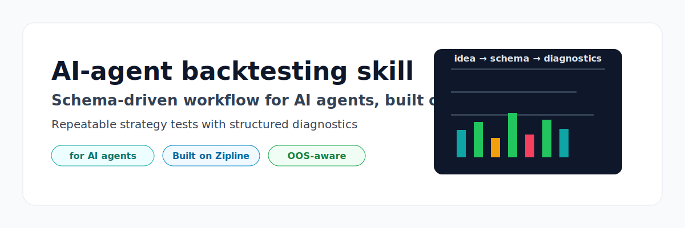
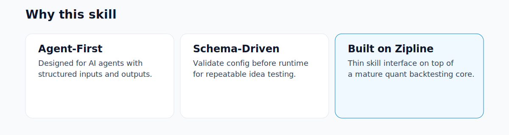
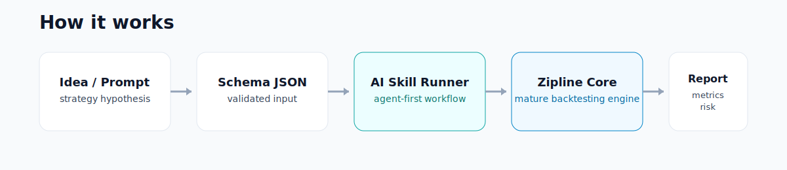
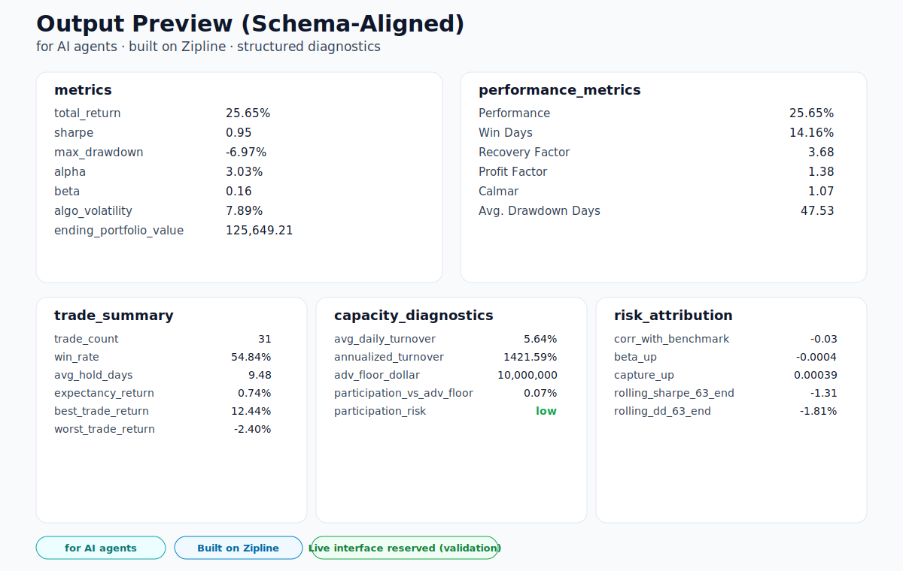

# Backtesting Skill

<p align="center">
  
</p>

<p align="center">
  
  
  
  
</p>

An AI-native backtesting skill for fast strategy idea evaluation.
It provides a schema-driven workflow for AI agents and runs on top of Zipline.

## Why This Exists

- Fast idea-to-backtest flow for AI agents
- Reproducible runs from constrained JSON schema
- Structured diagnostics beyond raw return metrics

This project is **not** a full portfolio optimization platform.

<p align="center">
  
</p>

## How It Works

<p align="center">
  
</p>

## Quick Start

Python 3.11+ is recommended.

```bash
python -m venv .venv
.venv\Scripts\activate
pip install -r requirements.txt
```

Validate a schema:

```bash
python scripts/run_backtest_from_schema.py --schema references/example_trend_dip_single_schema.json --validate-only
```

Run a single backtest:

```bash
python scripts/run_backtest_from_schema.py --schema references/example_trend_dip_single_schema.json
```

Run a grid search:

```bash
python scripts/run_backtest_from_schema.py --schema references/example_trend_dip_grid_schema.json
```

If bundle data is missing and schema allows it:

```bash
python scripts/run_backtest_from_schema.py --schema references/example_trend_dip_grid_schema.json --ingest-if-missing
```

## Output Preview

<p align="center">
  
</p>

Primary output blocks include:

- `metrics`
- `performance_metrics`
- `trade_summary`
- `capacity_diagnostics`
- `risk_attribution`
- `practical_assessment`

Grid mode adds:

- `top_results`
- `stability_diagnostics`

## Supported Templates

- `oversold_bounce_long_only`
- `sma_crossover_long_only`
- `trend_dip_buy_long_only`

Multi-symbol equal-weight mode is available for:

- `sma_crossover_long_only`
- `trend_dip_buy_long_only`

`oversold_bounce_long_only` remains single-symbol strategy logic.

## Data and Live Interface

- Active runtime data source: `data.source = "bundle"`
- Reserved data interfaces: `csv`, `parquet`, `custom` (schema-level placeholders)
- Reserved live interface: `live_data` (for example `ibkr`) is config validation only

See `references/schema.md` for complete fields and output contract.

## Project Layout

- `SKILL.md`: skill behavior and workflow
- `references/schema.md`: schema and output reference
- `references/example_*.json`: runnable examples
- `scripts/run_backtest_from_schema.py`: runner
- `scripts/ingest_yahoo_bundle.py`: optional ingestion helper

## License

MIT. See `LICENSE`.
